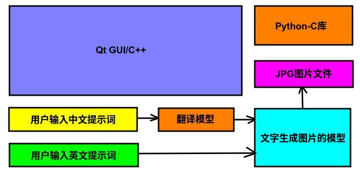

# WallpaperGen(高清壁纸生成器)
## 1、运行效果


## 2、编译环境搭建

### 2.1、操作系统与硬件要求

操作系统：Ubuntu 22

硬件平台：Intel酷睿或者志强，支持AVX指令集，内存32GB以上(实际占用内存峰值为25GB)

注意：本代码默认使用Python3.10版本，如果使用其他版本的Python，请修改WallpaperGen.pro文件中的包含目录

### 2.2、软件依赖安装

基本的软件依赖

```shell
sudo -E apt-get install gcc g++ make git vim build-essential git-lfs
```

安装python3

```shell
sudo -E apt-get install python python3 python3-pip
sudo -E pip3 install --upgrade pip
```

AI相关依赖

```shell
sudo -E pip3 install --upgrade diffusers transformers accelerate torch
```


### 2.3、模型下载

首先是中文到英文的翻译模型

模型位置：https://huggingface.co/Helsinki-NLP/opus-mt-zh-en

保存到的本地代码路径位置：./opus-mt-zh-en

下载命令

```shell
#!/bin/bash
git lfs install
git clone https://huggingface.co/Helsinki-NLP/opus-mt-zh-en
```

或者

```shell
#!/bin/bash
export HF_ENDPOINT=https://hf-mirror.com
huggingface-cli download --resume-download --local-dir-use-symlinks False Helsinki-NLP/opus-mt-zh-en --local-dir opus-mt-zh-en
```


然后是文字生成图片的模型

模型位置：https://huggingface.co/stabilityai/stable-diffusion-xl-base-1.0

保存到的本地代码路径位置：./stable-diffusion-xl-base-1.0

下载命令

```shell
#!/bin/bash
git lfs install
git clone https://huggingface.co/stabilityai/stable-diffusion-xl-base-1.0
```

或者

```shell
#!/bin/bash
export HF_ENDPOINT=https://hf-mirror.com
huggingface-cli download --resume-download --local-dir-use-symlinks False stabilityai/stable-diffusion-xl-base-1.0 --local-dir stable-diffusion-xl-base-1.0
```


### 2.4、环境验证

翻译模型的验证，执行下面脚本后，会输出【猫在爬树】的英文翻译。

```shell
./test_tsl.py
```

文字生成图片模型的验证，执行下面脚本后，会输出【沙漠中的桃花树】的相关图片，并保存为test.jpg文件。

```shell
./test_sdxl.py
```


### 2.5、Qt安装和编译

我这里使用的是qt5.13.2的linux安装包，可以从下面的地址下载

https://download.qt.io/new_archive/qt/5.13/5.13.2/qt-opensource-linux-x64-5.13.2.run

下载完成后，给该文件增加可执行权限

```shell
chmod +x qt-opensource-linux-x64-5.13.2.run
```

然后按照界面的提示一步一步安装即可，然后编译的话只要用Qt Creator打开我们源码中的WallpaperGen.pro工程即可

## 3、性能说明

​    实测本项目在使用Intel Core ULTRA7平台的笔记本电脑上，生成1920x1920分辨率的图片需要2.5小时

## 4、方案与原理

### 4.1、概述

​    本开源软件应用领域广泛，通常用于壁纸的生成，或者高清图片的生成，当然也可以配合第三方图像处理软件制作海报或者PPT等。同时该软件可以支持自定义分辨率图片的生成。

​    除了应用广泛以外，本软件最大的特点是开源，并且完全本地离线运行，保证了用户的隐私和数据安全。在Intel强大硬件的加速下，可以高效快速的响应用户的需求。并且基于Qt+Python开发，可以方便移植到各种嵌入式平台中，提高产品的人机交互体验。

​    该软件的整体思想是利用Qt制作UI界面，然后采用原生Python-C的库调用DiffusionPipeline的接口，从而使用本地的stable-diffusion-xl-base-1.0模型。当前您也可以根据自己的需要更换自己喜欢的自定义模型。

### 4.2、使用模型

https://huggingface.co/Helsinki-NLP/opus-mt-zh-en

https://huggingface.co/stabilityai/stable-diffusion-xl-base-1.0

### 4.3、工作流与软件结构



​    软件的结构和流程如上图所示，软件最底层是2个模型，其中文字生成图片的部分是通过Python调用DiffusionPipeline的diffusers。然后中文到英文的翻译模型是调用AutoModelForSeq2SeqLM的transformers。然后使用原生的Python-C的库通过CPyAI类进行封装。然后上层是Qt做的GUI，主要由CQtAI类进行对下层的接口抽象和分离。

​    当用户输入中文提示词的时候，中文文字先经过翻译模型转换为英文后，再将英文结果送入文字生成图片的模型。然后会将生成的模型保存成jpg图片文件，然后由Qt的GUI载入并显示该图片。当用户输入的提示词为英文的时候，就省去了中间的翻译过程，而直接将用户的提示词送入文字生成图片的模型中。


## 5、演示视频

【AIGC高清壁纸生成器(可本地离线运行)-哔哩哔哩】 https://b23.tv/gA3qQ25

## 6、联系方式

邮箱：rainhenry@savelife-tech.com

## 7、许可证

本代码采用GPLv3许可证 https://www.gnu.org/licenses/gpl-3.0.en.html
